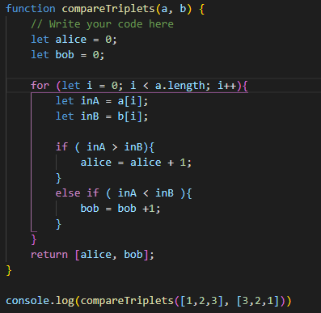
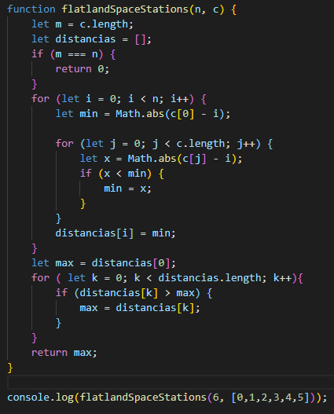

<h1>Algoritmos</h1>

<h1>1. compareTriplets</h1>

<h2>Como Correr el algoritmo</h2>
<ul>
<li>Clona el respositorio en una carpeta</li>
<li>Abre tu editor de codigo y en la terminal ejecuta: node compareTriplets.js</li>
</ul>

<h1>RESUMEN</h1>

    La funcion compareTriplets tiene dos parametros, el arreglo a y el arreglo b. Se declaran dos variables "alice" y "bob" y se inicializan en 0 ya que estas son las variables que van a guardar los puntos que gano gada uno.

    Despues se crea un cliclo for con el fin de recorrer los arreglos "a" y "b" y se compara con un if segun el indice de de cada arreglo a quien se le suma el punto y se agrega ala variable del que gano punto

    Finalmente se retorna un arreglo que tiene como elementos el puntaje de "alice" y de "bob"

    </img>

<h1>1. flatlandSpaceStations</h1>

<h2>Como Correr el algoritmo</h2>
<ul>
<li>Clona el respositorio en una carpeta</li>
<li>Abre tu editor de codigo y en la terminal ejecuta: node flatlandSpaceStations.js</li>
</ul>

<h1>RESUMEN</h1>

    La funcion flatlandSpaceStations tiene dos parametros, "n" que es la cantidad de cuidades y "c" que es un arreglo que tiene como elementos las ciudades que tienen estacion espacial. Se declaran dos variables "m" como indice del arrego "c" y "distancias" que inicia como un arreglo vacio, pero se va llenando de las distancias que existen desde totas las cuidades a la estaci0n espacial mas cercana.

    Despues se hace un if que dice que si "m" y "n" son igules sinifica que en cada cuidad existe una estacion espacial pot lo tanto la distancia desde cada cuidad a la estacin mas cerna es 0, seguido de esto se crea un cliclo for con el fin de desglosar "n".

    Despues se saca la distancia minima en la variable "min" donde se inicia con "Math.abs(c[0] - i)" y se agrega otro ciclo for para que recorra el arreglo "c" y se crea otra variable "x" que guarda "Math.abs(c[j] - i)" y se hace un if que compara si "(x < min)" entonces que reemplace el valor de la variable "min" por el vali de "x".

    Para agregar el numero maximo en el arreglo "distancias" se inicualizo una variable "max" con "distancias[0]", despues e recorrio el arreglo "ditancias" con un ciclo for y con un if se compara "(distancias[k] > max)" y en caso que "distancias[k]" se reemplaza el valir de "max" po rl de "distancias[k]".

    Finalmente se retorna la distancoa maxima que existe entre las cuidades a la estacion espacial mas cercana

    </img>

<h1> TECNOLOGIAS</h1>
    <ul>
        <li>Java Script</li>
        <li>Node JS</li>
    </ul>

